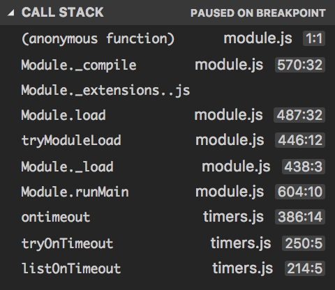

# Node.js 中的模块机制

[TOC]

ECMAScript 标准对描述了在构建面向浏览器端的应用时可用的 API，但是这些 API 更多是基于其浏览器环境的支持，通过浏览器在全局环境下添加各种对象对 ECMAScipt 标准进行实现，这带来了几个问题：

1. 没有模块系统，没有原生实现的封闭作用域
2. 没有包管理系统

这使得 JavaScript 在浏览器以外的环境中无法使用。

Node.js 应用基本单元为模块，采用了 CommonJS 模块规范，同时 NPM 也是基于 Common.js 定义的包规范，实现了模块的依赖管理和自动安装等功能。

## 基本用法

每个文件就是一个模块，有自己的作用域，每个模块文件具有私有的变量、函数、类，避免了全局变量污染。如果需要多个模块共享变量，可以使用`global`对象，定义为 global 变量的属性，成为全局变量。

`require`方法用于加载模块

`module.exports` 用于导出模块

### exports 与 module.exports

exports 是 module.exports 的别名，即 exports = module.exports = {}

但是，当 exports = fn 的操作时，exports 和module.exports 不再指向同一个指针，module.exports 和 exports 不再有关系

在第三方库里经常看到` exports = module.exports = fn; `这种用法

就是为了保证在改变 module.exports 之后，exports 和 module.exports 仍然指向的是同一个指针

下面是 express.js 中的部分代码

```javascript
exports = module.exports = createApplication;

/**
 * Create an express application.
 *
 * @return {Function}
 * @api public
 */

function createApplication() {
  var app = function(req, res, next) {
    app.handle(req, res, next);
  };

  mixin(app, EventEmitter.prototype, false);
  mixin(app, proto, false);

  app.request = { __proto__: req, app: app };
  app.response = { __proto__: res, app: app };
  app.init();
  return app;
}

/**
 * Expose the prototypes.
 */

exports.application = proto;
exports.request = req;
exports.response = res;
```

在实际写代码过程中， 如果你搞不清楚两者的关系，可以直接忽略 exports 直接使用 module.exports，因为 require 其实调用的是 module.exports 里的代码


### require 查找module的完整过程

```
require(X) from module at path Y
1. If X is a core module,
   a. return the core module
   b. STOP
2. If X begins with './' or '/' or '../'
   a. LOAD_AS_FILE(Y + X)
   b. LOAD_AS_DIRECTORY(Y + X)
3. LOAD_NODE_MODULES(X, dirname(Y))
4. THROW "not found"

LOAD_AS_FILE(X)
1. If X is a file, load X as JavaScript text.  STOP
2. If X.js is a file, load X.js as JavaScript text.  STOP
3. If X.json is a file, parse X.json to a JavaScript Object.  STOP
4. If X.node is a file, load X.node as binary addon.  STOP

LOAD_AS_DIRECTORY(X)
1. If X/package.json is a file,
   a. Parse X/package.json, and look for "main" field.
   b. let M = X + (json main field)
   c. LOAD_AS_FILE(M)
2. If X/index.js is a file, load X/index.js as JavaScript text.  STOP
3. If X/index.json is a file, parse X/index.json to a JavaScript object. STOP
4. If X/index.node is a file, load X/index.node as binary addon.  STOP

LOAD_NODE_MODULES(X, START)
1. let DIRS=NODE_MODULES_PATHS(START)
2. for each DIR in DIRS:
   a. LOAD_AS_FILE(DIR/X)
   b. LOAD_AS_DIRECTORY(DIR/X)

NODE_MODULES_PATHS(START)
1. let PARTS = path split(START)
2. let I = count of PARTS - 1
3. let DIRS = []
4. while I >= 0,
   a. if PARTS[I] = "node_modules" CONTINUE
   c. DIR = path join(PARTS[0 .. I] + "node_modules")
   b. DIRS = DIRS + DIR
   c. let I = I - 1
5. return DIRS
```

### require 的缓存

模块第一次被 require 之后，将会被缓存，以后继续 require 同一个文件将会获得同一个实例对象。

注意这里是同一文件，无论是通过相对还是绝对路径引用的，只要是同一个文件，就不会被重新加载。

所有被缓存的模块保存在 `require.cache` 中，以对象形式保存，键名为模块名

通过`delete` 其中对应的模块即可删除模块缓存。

### require.main

用于判断模块是直接执行还是被其他模块调用

直接执行时 `require.main` 等于模块本身 `module`

### 模块循环引用

@Todo 

### 模块的加载机制

创建一个 Js 文件，在 VSCode 里进行调试，断点设置在第一行

```javascript
console.log('test');
```

查看调用栈：



```javascript
  var dirname = path.dirname(filename);
  var require = internalModule.makeRequireFunction.call(this);
  var args = [this.exports, require, this, filename, dirname];
  var depth = internalModule.requireDepth;
  if (depth === 0) stat.cache = new Map();
  var result = compiledWrapper.apply(this.exports, args);  // << breakpoint
  if (depth === 0) stat.cache = null;
  return result;
```

可以看到，这里将模块被加载时会被一个compile 函数包裹，其参数包括 module.exports 、require、exports、_\_filename、__dirname